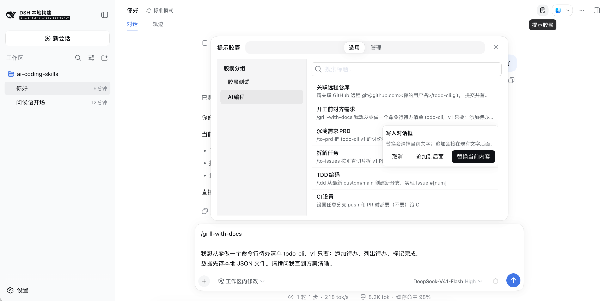
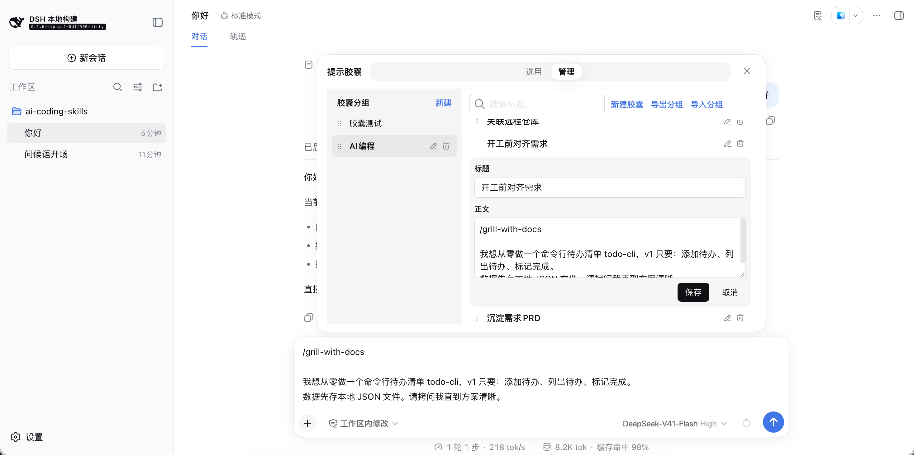
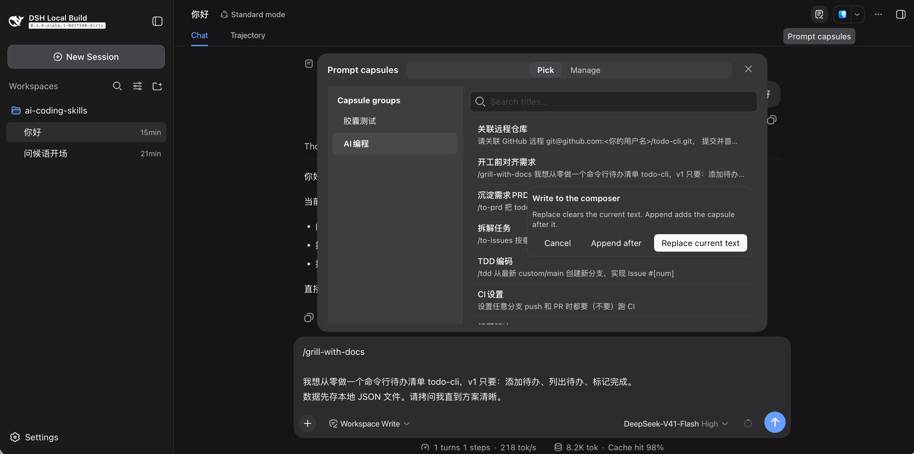

# @nangeagi/dsh-sop-capsules

DeepSeek Harness 插件，**提示胶囊**：在当前工作区沉淀可复用 SOP / 提示片段，并在会话输入框中一键注入。当前最新版本为0.2.0，适配DSH对应版本0.2.0-x。
作者：@南哥AGI研习社（B站、YouTube）

## 功能

- 工作区库：数据落在 `<工作区根>/.dsh/sop-capsules/`（库清单 + 分组 yaml），随项目版本管理或备份。
- 会话头入口：在输入框上方打开胶囊面板；未绑定工作区时会话头入口禁用并提示先选工作区。
- 选用：按分组浏览、按标题搜索；替换 / 追加 将胶囊正文写入当前输入框草稿（不自动发送）；注入后关闭面板并回到输入框；注入模式按工作区记忆。
- 管理：分组与胶囊的新建 / 重命名 / 删除、拖拽排序；单分组 yaml 导出与导入。
- 斜杠引用样式：输入框中与当前会话指令名、内置指令声明词或技能名完全一致的 `/词` 显示为引用样式；其余斜杠文本保持纯文本。
- 宿主远程接口：Typert 命名空间 `sopCapsules`（`listLibrary`、`getGroup`、`saveGroup`、`deleteGroup`、`reorderGroups` 等），Web 端经 `$mount` 的 `./remote` 调用，不走裸文件远程读写。








界面预览及源码下载地址：https://github.com/NanGePlus/dsh-sop-capsules

## 安装与使用

要求：已安装 DeepSeek Harness（`dsh` 命令行）。

npm安装：

```sh
dsh plugin --profile web add @nangeagi/dsh-sop-capsules
dsh web
```

GitHub安装：

```sh
dsh plugin --profile web add github:NanGePlus/dsh-sop-capsules
```

卸载：

```sh
dsh plugin --profile web remove @nangeagi/dsh-sop-capsules
```


## 二次开发


### 包结构

```text
src/index.ts              # 宿主：SopCapsulesService + Typert 远程层
src/library-io.ts         # 库根路径、清单、校验
src/client/index.ts       # Web 端 apply：挂载 remote、注册插槽与文案
src/client/SopCapsulesPanel.tsx
cordis.patch.yml            # 正式安装 → lib/
cordis.source.patch.yml     # 本地 --patch → src/
```


### 在 Harness 多包仓库内开发

```sh
pnpm install
pnpm --filter @nangeagi/dsh-sop-capsules build
```

Web 端热更新 + 宿主联调（仓库根目录）：

```sh
# 终端 A
pnpm run dev:web

# 终端 B
pnpm dsh web --patch plugins/sop-capsules/cordis.source.patch.yml
```

仅改宿主或不需要热更新时，只跑终端 B 即可。改 `src/client/` 依赖终端 A 重建 `lib/client.js`；改宿主需重启 `dsh web`。

## DeepSeek Harness 学习推荐

本系列带大家零基础上手 DeepSeek Harness，沿着一条能真正走完的路径，从安装到插件交付的全链路实战：

📦 安装上手 → 🧠 核心认知 → 🛠️ 源码部署 → 🔌 插件交付 → 🤖 AI 辅助开发 → 📊 可观测链路

**目前已在频道更新内容：**

【EP01】零基础上手 DeepSeek Harness，从这一步开始。一键安装 + 页面功能 + 插件挂载和卸载
【EP02】搞懂 DeepSeek Harness，从这一层开始。概念 + 架构 + 四种 Agent 模式 + Profile/Bundle/Patch
【EP03】深入 DeepSeek Harness，从源码跑起来开始。源码安装 + 运行实操 + 配置说明
【EP04】搞定 DeepSeek Harness 插件交付，从这 4 种方式开始。本地 + tarball + npm registry + Git 仓库
【EP05】用 AI Coding SOP 高效写 DeepSeek Harness 插件，需求对齐->规划拆解->分拣实现->排错修复->架构维护和交付
期待更多……

🎬 视频合集链接：

B站视频链接：[https://www.bilibili.com/video/BV1fJYk6NEQb/](https://www.bilibili.com/video/BV1fJYk6NEQb/)
YouTube视频链接：[https://www.youtube.com/playlist?list=PLaooKLIkjb0g](https://www.youtube.com/playlist?list=PLaooKLIkjb0g)

【充电视频 · AGI研习｜进阶（30元档）】持续更新中，感兴趣的朋友欢迎充电支持，非常感谢大家：

（1）**零基础上手 DeepSeek Harness：从安装到插件交付的全链路实战**

B站视频链接：[https://www.bilibili.com/video/BV1fJYk6NEQb/](https://www.bilibili.com/video/BV1fJYk6NEQb/)

YouTube视频链接：[https://www.youtube.com/playlist?list=PLaooKLIkjb0g](https://www.youtube.com/playlist?list=PLaooKLIkjb0g)

（2）**零基础上手 Skill：从 0 到交付的全链路闭环实战**

B站视频链接：[https://www.bilibili.com/video/BV1TNGZ6uEGQ/](https://www.bilibili.com/video/BV1TNGZ6uEGQ/) 

YouTube视频链接：[https://www.youtube.com/playlist?list=PL8zBXedQ0ufmOXOUX0kOZMrYt1C4fjg2T](https://www.youtube.com/playlist?list=PL8zBXedQ0ufmOXOUX0kOZMrYt1C4fjg2T) 

（3）**零基础上手 n8n v2.x 实战：打造 n8n 驱动的自动化生产线**

B站视频链接：[https://www.bilibili.com/video/BV1Aq1NBYELp/](https://www.bilibili.com/video/BV1Aq1NBYELp/)

YouTube 视频链接：[https://www.youtube.com/playlist?list=PL8zBXedQ0uflhkZBwlQNAp7H57CJFgfgV](https://www.youtube.com/playlist?list=PL8zBXedQ0uflhkZBwlQNAp7H57CJFgfgV)

（4）**零基础上手OpenClaw系列：从零打造智能体驱动的商业自动化闭环**

B站视频链接：[https://www.bilibili.com/video/BV1svQGBBERQ/](https://www.bilibili.com/video/BV1svQGBBERQ/)

YouTube视频链接：[https://www.youtube.com/playlist?list=PL8zBXedQ0ufmtUvaHsSxNqZMwgb3hxsJB](https://www.youtube.com/playlist?list=PL8zBXedQ0ufmtUvaHsSxNqZMwgb3hxsJB)

（5）**零基础上手 LangChain V1.x 实战： 学最主流 Agent 开发框架**

B站视频链接：[https://www.bilibili.com/video/BV17c6mBbEHv/](https://www.bilibili.com/video/BV17c6mBbEHv/)

YouTube 视频链接：[https://www.youtube.com/playlist?list=PL8zBXedQ0ufld2C7nB28fGw9U6nTbagp1](https://www.youtube.com/playlist?list=PL8zBXedQ0ufld2C7nB28fGw9U6nTbagp1)

## AI Coding 学习推荐

如果你正在使用 Cursor、Claude Code、Codex 等 AI 编程助手，却常常是：

需求还没想清楚 → 就让AI开写

越改越偏 → 还不知道改了什么

没有测试 → 全凭肉眼“好像行”

项目一变大 → 代码不敢动，也不敢交给别人

最后累死累活，代码还是失控的。

我的AI Coding SOP，专门解决这个问题：

❶ 先问清楚“到底要做什么”

❷ 写成可执行的需求文档

❸ 拆成一条条很小的、可交付的任务

❹ 每条任务都用测试 + 代码审查把关

核心不是教你怎么跟AI聊天，

而是让AI写的每一步，你都能检查、能说明、能回头。

AI写代码，真正受你控制。

想了解详情的戳下面这个链接，感谢大家的支持！

获取方式1:

[https://mall.bilibili.com/neul-next/detailuniversal/detail.html?page=detailuniversal_detail&itemsId=41424824&loadingShow=1&noTitleBar=1#noReffer=true&msource=merchant_share](https://mall.bilibili.com/neul-next/detailuniversal/detail.html?page=detailuniversal_detail&itemsId=41424824&loadingShow=1&noTitleBar=1#noReffer=true&msource=merchant_share)

获取方式2:

[https://www.patreon.com/nangeagi/posts/ni-shi-bu-shi-ye-166882633?utm_medium=clipboard_copy&utm_source=copyLink&utm_campaign=postshare_creator&utm_content=join_link](https://www.patreon.com/nangeagi/posts/ni-shi-bu-shi-ye-166882633?utm_medium=clipboard_copy&utm_source=copyLink&utm_campaign=postshare_creator&utm_content=join_link)

## 许可证

MIT · 南哥AGI研习社（B站、YouTube）